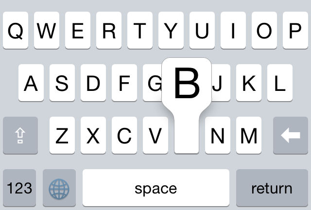
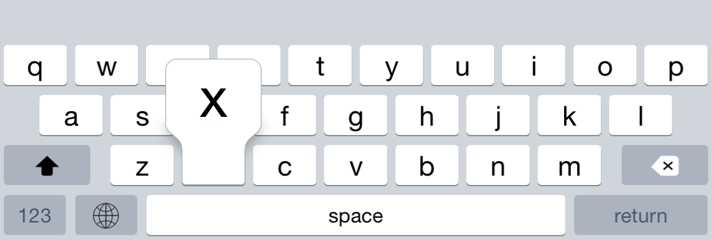
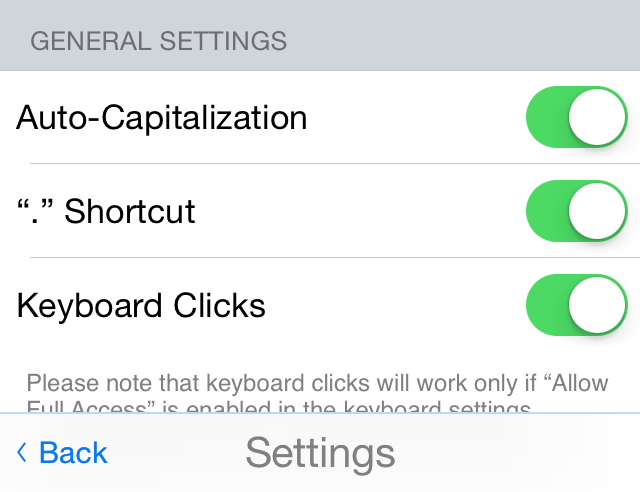

# Tasty Imitation Keyboard

I'm working on a 3rd party keyboard for iOS8 and I want it to look and feel as close as possible to Apple's keyboard. Unfortunately, it's not possible to access the keyboard view through code, so this is my attempt to imitate it by hand. (I'm sure there are ways to get even more accuracy via reverse engineering, but that's too much work for me!) In the end, I hope to produce a coherent and robust baseline for creating custom 3rd party keybards — at least, until Apple decides to fully open up their keyboard API.

This keyboard is currently optimized for iPhone. iPad should work, but it'll look like a giant iPhone keyboard.

## Recent Screenshots

</img>
</img>
</img>

## Fantastic Features

* No bitmaps! Everything is rendered using CoreGraphics.
* Dynamic layouts! All the keys are laid out programmatically, meaning that the keyboard is much easier to extend and will automatically work on devices of all sizes.
* Auto-capitalization, period shortcut, keyboard clicks.
* An extensible settings screen.
* Dark mode and solid color mode.
* This keyboard is an iOS8 extension.

## Current State

We are in alpha! The basic features and appearance should all be there by now. I'll try to not commit broken builds anymore.

Good news! [I now have an app in the App Store that's built on top of this keyboard](http://translit-keyboard.archagon.net), so we know that it can pass the App Store review process.

Hold-to-select-alternate-characters will be implemented at a later time.

## Build Instructions

1. Edit Scheme for the Keyboard target and set the Executable to be HostingApp.app.
2. Run the Keyboard target.
3. Go to `Settings → General → Keyboard → Keyboards → Add New Keyboard` on your device and add the third-party keyboard.
4. Go back to the app. You should be able to select the keyboard via the globe icon.

## Learning Goals

* Swift
* 3rd party extensions
* 3rd party frameworks (for IB use)
* Autolayout
* CoreGraphics
* finally release an app on the App Store, darn it

## Other Stuff

Please consult [the project wiki](https://github.com/archagon/tasty-imitation-keyboard/wiki) for technical details. You may find it handy if you're implementing your own keyboard!

I made a 3rd party functionless keyboard with a similar layout but a much simpler program structure for debugging purposes. You can find it here: [faux-testing-keyboard](https://github.com/archagon/faux-testing-keyboard)

🙀 **Please forgive the *incredibly confusing* code in some of the classes. I started out trying to be all neat and perfect, but a self-imposed deadline for a personal project forced me to barge forward closer to release. And you know how that goes...** 🙀

Finally, keep in mind that I am not a framework maintainer nor intend to become one. This release is public and open source because I have no reason to keep it private, not because I wish to improve it for years on end (though I still may). Expect work on this project to be sporadic at best. If you wish to use this in production, rather than waiting on me, I strongly encourage you to fork.

## License

This project is licensed under the 3-clause ("New") BSD license. Go Bears!