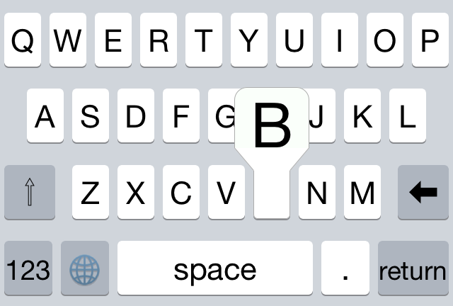

# Tasty Imitation Keyboard

I'm working on a 3rd party keyboard and I want it to look and feel as close as possible to Apple's keyboard. Unfortunately, to my knowledge, it's not possible to access the keyboard view through code, so I have to imitate it by hand. (I'm sure there are ways to get even more accuracy via reverse engineering, but that's too much work for me!)

Learning goals for this project:

* Swift
* 3rd party extensions
* autolayout
* finally release an app on the App Store, darn it

The actual keyboard is under the `Keyboard` directory. `TransliteratingKeyboard` is the hosting app. Everything else is garbage. (I'll clean it up later.)

Here's a screenshot generated from the latest build:

