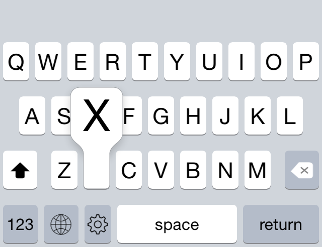

# Tasty Imitation Keyboard

I'm working on a 3rd party keyboard for iOS8 and I want it to look and feel as close as possible to Apple's keyboard. Unfortunately, it's not possible to access the keyboard view through code, so this is my attempt to imitate it by hand. (I'm sure there are ways to get even more accuracy via reverse engineering, but that's too much work for me!) In the end, I hope to produce a coherent and robust baseline for creating custom 3rd party keybards — at least, until Apple decides to fully open up their keyboard API.

## Recent Screenshots

</img>
</img>

## Fantastic Features

* No bitmaps! Everything is rendered using CoreGraphics.
* Autolayout galore! All the keys are laid out using autolayout constraints, meaning that the keyboard is much easier to extend.
* This keyboard is an iOS8 extension.

## Current State

The development of this keyboard is out in the open, so the project may not work at all times. At the present moment, the baseline functionality is there. Left to implement are special characters, Shift, multitouch, and improved graphics (including translucenty and dark mode).

Hold-to-select-alternate-characters will be implemented at a later time.

## Build Instructions

1. Edit Scheme for the Keyboard target and set the Executable to be HostingApp.app.
2. Run the Keyboard target.
3. Go to `Settings→General→Keyboard→Keyboards→Add New Keyboard` on your device and add the third-party keyboard.
4. Go back to the app. You should be able to select the keyboard via the globe icon.

## Learning Goals

* Swift
* 3rd party extensions
* 3rd party frameworks (for IB use)
* autolayout
* CoreGraphics
* finally release an app on the App Store, darn it

## Other Stuff

Please consult [the project wiki](https://github.com/archagon/tasty-imitation-keyboard/wiki) for technical details. You may find it handy if you're implementing your own keyboard!

I made a 3rd party functionless keyboard with a similar layout but a much simpler program structure for debugging purposes. You can find it here: [faux-testing-keyboard](https://github.com/archagon/faux-testing-keyboard)

## License

This project is licensed under the 3-clause ("New") BSD license. (Go Bears!)